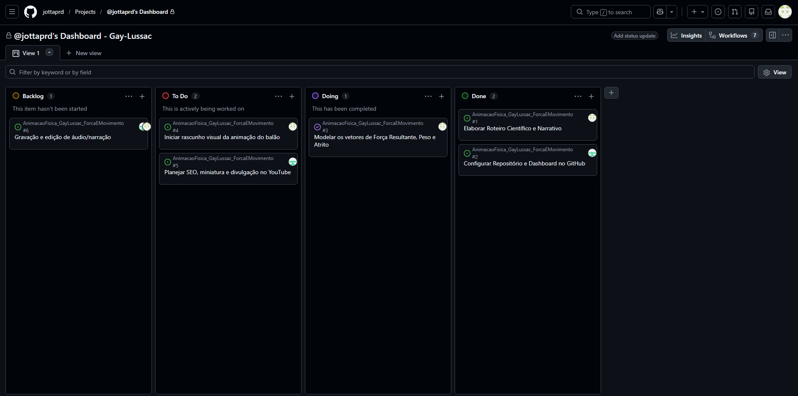

# Projeto de Animação: Gay-Lussac - Força e Movimento

**Tema Atribuído:** Força e Movimento (As três leis de Newton, força de atrito e peso).
**Nome do Grupo:** Gay-Lussac

## Integrantes
- João Pedro Preto Felix
- Kauã Lucas Torres da Silva
- Kauã Vailantes Amin
- Henrique Oliveira
- Enzo Carvalho
- Sergio Leal

## 📊 Etapa 3: Dashboard e Planejamento (Entregue em 17/09)

Nosso grupo adotou a metodologia ágil utilizando o GitHub Projects (Kanban). Abaixo está o registro da movimentação das nossas entregas e o planejamento das próximas semanas, com os responsáveis já definidos (atendendo à Etapa 3 do cronograma).

> **[Link direto para o nosso Project Board](https://github.com/users/jottaprd/projects/2/views/1)**

### Histórico de Movimentação do Board
*(Print registrado em 17/09 provando a estrutura do Kanban e a divisão de tarefas)*

---
*O Roteiro Científico (Etapa 1) já se encontra finalizado e armazenado na pasta `/docs` deste repositório.*
